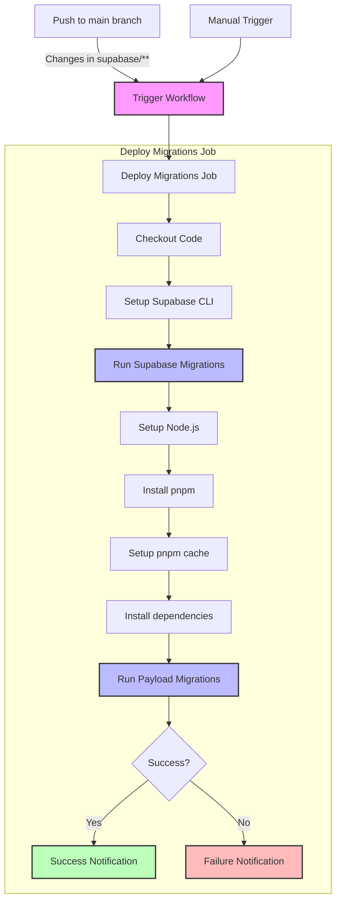

```mermaid
flowchart TD
    A[Push to main branch] -->|Changes in supabase/**| B[Trigger Workflow]
    C[Manual Trigger] --> B
    B --> D[Deploy Migrations Job]

    subgraph "Deploy Migrations Job"
        D --> E[Checkout Code]
        E --> F[Setup Supabase CLI]
        F --> G[Run Supabase Migrations]
        G --> H[Setup Node.js]
        H --> I[Install pnpm]
        I --> J[Setup pnpm cache]
        J --> K[Install dependencies]
        K --> L[Run Payload Migrations]
        L --> M{Success?}
        M -->|Yes| N[Success Notification]
        M -->|No| O[Failure Notification]
    end

    style B fill:#f9f,stroke:#333,stroke-width:2px
    style G fill:#bbf,stroke:#333,stroke-width:2px
    style L fill:#bbf,stroke:#333,stroke-width:2px
    style N fill:#bfb,stroke:#333,stroke-width:2px
    style O fill:#fbb,stroke:#333,stroke-width:2px
```
