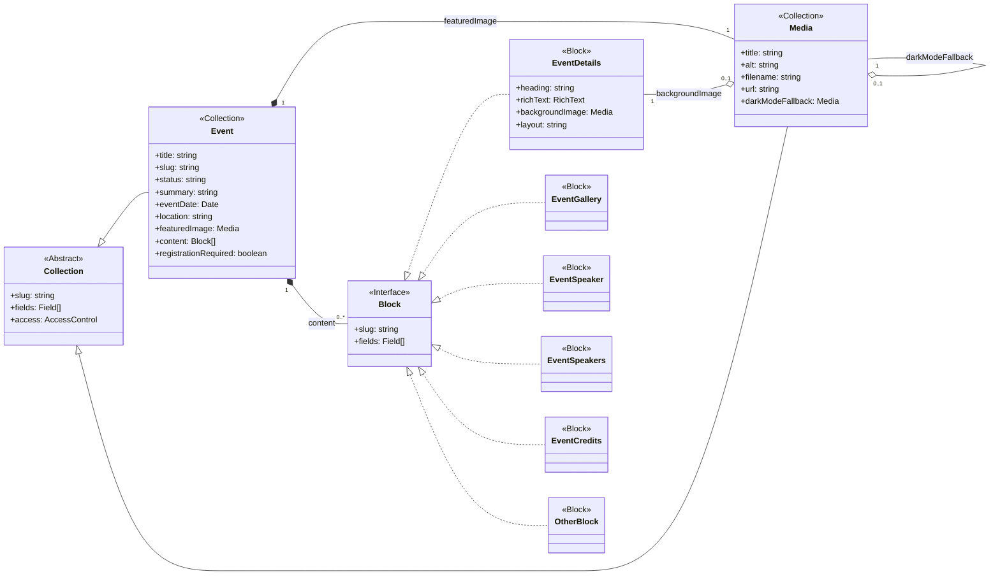

# Collections and Blocks Overview

This document provides a summary of the main data collections and content blocks used in this project, focusing on their structure and relationships.

## Main Entities

1.  **`Event` (Collection):** The central entity representing events. It stores core details (title, date, location, status, summary) and requires a `featuredImage`. Its `content` field uses various Blocks for flexible page building. Integrates with a Drizzle database representation.
2.  **`Media` (Collection):** Manages media assets (primarily images). Stores files and metadata (`alt`, `title`). Can relate to itself (e.g., `darkModeFallback`). Referenced by `Event` and potentially by Blocks.
3.  **Blocks (`EventDetails`, `EventGallery`, `EventSpeaker`, `EventSpeakers`, `EventCredits`, etc.):** Reusable content components defined in `app/blocks/`. Used within the `Event` collection's `content`. Specific blocks like `EventDetails` can also reference `Media`.

## Relationships Diagram

## Building Event Detail Pages

Event detail pages (rendered by `app/(public)/events/[slug]/page.tsx`) are constructed using the **`Events` collection** and its associated **Blocks**.

**Strategy:**

1.  **Core Event Data:** Define essential event information (title, date, location, status, summary, featured image) directly as fields within the `Events` collection (`app/collections/Events.ts`).
2.  **Flexible Content:** Use the `content` field (type `blocks`) within the `Events` collection to build the main body of the event page. Editors can add, remove, and reorder various blocks to create unique layouts.
3.  **Create Specific Blocks:** For different types of content needed on event pages (e.g., schedule, speaker bios, venue maps, FAQs, sponsor logos), create dedicated Block configurations in the `app/blocks/` directory.
4.  **Register Blocks:** Import and add the newly created Block configurations to the `blocks` array within the `content` field definition in `app/collections/Events.ts`.
5.  **Render Blocks:** The frontend component `RenderBlocks` (in `components/payload-cms/RenderBlocks.tsx`) handles rendering the blocks based on their `blockType`. Ensure you create corresponding React components for any new blocks you add (following the pattern of existing block components like `EventDetailsBlock`, etc.).

**Onboarding:**

- To add new types of content to event pages, **create a new Block** in `app/blocks/`, define its fields, and **register it** in `app/collections/Events.ts`.
- Then, **create the corresponding React component** to render this new block type, ensuring it's imported and handled within `RenderBlocks` or a similar mapping mechanism.
- Editors can then use this new block when creating or editing events in the Payload admin panel.
